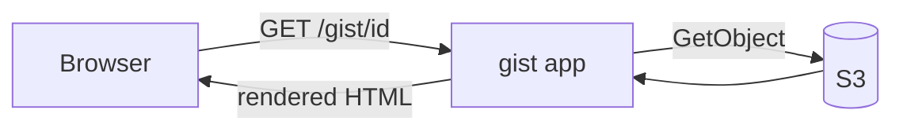

# Markdown Showcase

This file exercises everything this gist renders. The metadata table above is
**YAML front matter**; hover any heading to get its **permalink anchor**.

- [Basics](#basics)
- [Task lists](#task-lists)
- [Tables](#tables)
- [Alerts](#alerts)
- [Footnotes](#footnotes)
- [Emoji](#emoji)
- [Code](#code)
- [Diagrams](#diagrams)
- [Math](#math)
- [Images](#images)
- [Raw HTML](#raw-html)
- [What is not rendered](#what-is-not-rendered)

## Basics

*Emphasis*, **strong, with ***nested*** emphasis*, and ~~strikethrough~~.
Inline `code` stays monospaced. A single newline flows into the same line,
while two trailing spaces force a hard
break — right here.

Bare URLs autolink: https://example.com/autolinked and www.example.com, as
does <https://example.com/explicit>. Reference links work too, as does
[goldmark][goldmark-ref], the parser behind this.

> A plain blockquote. Blockquotes nest:
>
> > like this, with a `code span` and a [link](https://example.com).

1. Ordered lists
2. with nested items
   - including unordered children
     1. and ordered grandchildren

---

## Task lists

- [ ] An unchecked task
- [x] A checked task
- [ ] A parent with children:
  - [ ] nested open
  - [x] nested done

## Tables

| Feature | Syntax | Works |
|:--------|:------:|------:|
| Alignment | `:---:` | :white_check_mark: |
| Escaped pipes | `a \| b` in a cell | renders as a literal pipe |
| Strikethrough in cells | ~~gone~~ | yes |
| Inline code | `fn(1)` | yes |

## Alerts

> [!NOTE]
> The default informational callout.

> [!TIP]
> Alerts accept **full markdown** inside:
>
> - lists
> - `code`
> - more [links](https://example.com)

> [!IMPORTANT]
> Multi-paragraph alerts work too.
>
> Second paragraph, with a fenced block:
>
> ```ini
> key = value
> ```

> [!WARNING]
> Watch out.

> [!CAUTION]
> Danger.

## Footnotes

This claim has a footnote[^note]. Here is the same footnote referenced
again[^note], which is legal and counts references. Labels can be words,
not just numbers:[^long-label].

[^note]: Defined once, referenced twice. The back-arrows jump back.
[^long-label]: Footnote labels survive inline markup too — *this* one even has emphasis.

## Emoji

:tada: :rocket: :fire: :sparkles: :bulb: :bug: :white_check_mark: :hammer:
Shortcodes resolve inline in text and :memo: inside tables. An unknown
`:not_a_real_emoji:` stays literal, and inline code like `:tada:` is left
alone.

## Code

Standalone code files and fenced blocks are highlighted by the file extension
or fence language, and get a copy button on hover.

```go
package main

import "fmt"

func main() {
    fmt.Println("hello, gist")
}
```

```python
def fib(n):
    a, b = 0, 1
    for _ in range(n):
        a, b = b, a + b
    return a
```

```sql
SELECT name, COUNT(*) AS n
FROM gists
GROUP BY name
HAVING COUNT(*) > 1;
```

```totally_made_up_language
this info string matches no lexer and falls back to plain text
```

## Diagrams

A ` ```mermaid ` fence loads the bundled Mermaid library only on pages that
need it:



## Math

Inline math survives markdown parsing — `$x_i$` keeps its underscore instead
of emphasizing, and `\(y^2\)` works with TeX delimiters too. Display math:

$$
\frac{d}{dx}\left( \int_0^x f(u)\,du \right) = f(x)
$$

\[
e^{i\pi} + 1 = 0
\]

Money is not math: "$5 and $6" are amounts, not delimiters, and code spans
like `$f(x)$` are left alone.

## Images

Images get `max-width: 100%`; GitHub's explicit sizing syntax sets the
rendered box — note the space before `=`:


## Raw HTML

Raw HTML is sanitized to a safe subset, GitHub-style: `details`, `kbd`,
`ruby` and a few dozen other tags survive; unknown tags keep their text
but lose the markup.

<details>
<summary>Click to expand — markdown renders inside</summary>

- lists
- `code`
- **emphasis**

> [!TIP]
> Alerts nest inside collapsibles too.

</details>

Shortcut keys are real markup: press <kbd>Ctrl</kbd>+<kbd>K</kbd>.

## What is not rendered

Dangerous markup dies in the sanitizer: `<script>`, `<iframe>`, `<svg>`,
`<style>`, form controls and event handlers like `onclick` never reach the
browser. GitHub app-level links stay literal too: `@mentions`, issue refs
like #42, and commit hashes like a23f9c1 are just text here.

[goldmark-ref]: https://github.com/yuin/goldmark "goldmark: a CommonMark + GFM compatible Markdown parser in Go"
